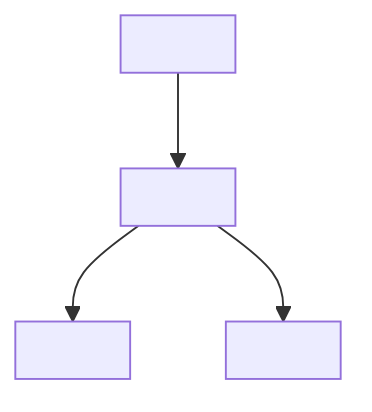
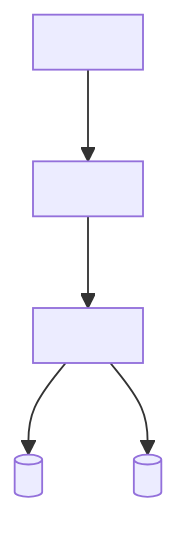

# SDLC Agent Flows — Phase 2 Implementation Plan

> **For agentic workers:** REQUIRED SUB-SKILL: Use superpowers:subagent-driven-development (recommended) or superpowers:executing-plans to implement this plan task-by-task. Steps use checkbox (`- [ ]`) syntax for tracking.

**Goal:** Expand the SDLC workflow toolkit with BRD, Architecture, Test Plan skills, cross-document validation, and document structure validation.

**Architecture:** Single package `@andy-toolforge/sdlc-workflows`. New MCP tools added to existing `mcp-tools.js`. New skills follow the same SKILL.md pattern as Phase 1 (YAML frontmatter, 9-step workflow, inline template fallback, optional Learn step). Template resolution order: local override → MCP → inline fallback.

**Tech Stack:** JavaScript (CommonJS), `@andy-toolforge/core` (LLMClient), Node.js `fs`/`path` for template serving, Node.js `node:test` runner for JS tests.

## Global Constraints

- All packages use CommonJS (`require()` / `module.exports`) — no ESM
- SKILL.md files must have YAML frontmatter with `id`, `version`, `standard`, `category`
- Each SKILL.md must include inline template fallback + optional Learn step
- MCP tool definitions use format: `{ definition: { name, description, inputSchema }, handler: async (llm, args) => {} }`
- MCP handlers must use `resolveLLM()` pattern: try `_llm` first, then fallback to `new LLMClient()` from `GEMINI_API_KEY`
- Template resolution order: `.opencode/templates/<path>` (local override) → MCP tool → inline fallback in SKILL.md
- New skills must have YAML test cases in `skills/<name>/test/` with `basic-<name>.yaml`
- Design doc at `docs/sdlc-agent-flows-design.md` — spec reference
- Design doc at v2.5 (commit 8a7730b)

---

### Task 1: MCP Tools — validate_document + sdlc_validate_skill

**Files:**
- Modify: `packages/sdlc-workflows/mcp-tools.js` — add 2 new tools

**Interfaces:**
- Consumes: existing `mcp-tools.js` structure (CommonJS factory pattern with `__dirname` path resolution)
- Produces: `validate_document({ documentPath, standard })` → `{ valid, errors[], warnings[], structureHealth }`
- Produces: `sdlc_validate_skill({ skillPath, testCase })` → `{ valid, errors[], warnings[], generatedPreview }`

- [ ] **Step 1: Add `validate_document` tool definition**

```js
const validateDocDef = {
    name: 'validate_document',
    description: 'Validate an SDLC document against a standard (agile, ieee-829, ieee-29148, arc42, iso-29119). Checks structure, required sections, YAML frontmatter, and cross-ref consistency.',
    inputSchema: {
        type: 'object',
        properties: {
            documentPath: {
                type: 'string',
                description: 'Path to the document file to validate (absolute or relative to cwd)',
            },
            standard: {
                type: 'string',
                enum: ['agile', 'ieee-29148', 'ieee-829', 'iso-29119', 'arc42'],
                description: 'Standard to validate against',
            },
        },
        required: ['documentPath', 'standard'],
    },
};
```

- [ ] **Step 2: Implement `validateDocumentHandler`**

```js
async function validateDocumentHandler(_llm, args) {
    const { documentPath, standard } = args;
    if (!documentPath || !standard) {
        throw new Error('documentPath and standard are required');
    }

    const resolvedPath = path.resolve(documentPath);
    if (!fs.existsSync(resolvedPath)) {
        throw new Error(`Document not found: ${documentPath}`);
    }

    const content = fs.readFileSync(resolvedPath, 'utf-8');
    const errors = [];
    const warnings = [];

    // 1. Check YAML frontmatter
    const hasFrontmatter = content.startsWith('---');
    const fmMatch = content.match(/^---\n([\s\S]*?)\n---/);
    if (!hasFrontmatter) errors.push('Missing YAML frontmatter');
    else if (!fmMatch) errors.push('Malformed YAML frontmatter: missing closing ---');
    else {
        try {
            const fm = require('js-yaml').load(fmMatch[1]);
            if (!fm.version) warnings.push('Frontmatter missing version field');
            if (!fm.standard) warnings.push('Frontmatter missing standard field');
        } catch (e) {
            errors.push(`Invalid YAML frontmatter: ${e.message}`);
        }
    }

    // 2. Check required sections per standard
    const standards = {
        'agile': ['## 1. Vision', '## 3. Problem Statement', '## 5. Features'],
        'ieee-29148': ['## 1. Purpose', '## 3. Stakeholders', '## 5. Functional Requirements'],
        'ieee-829': ['## 1. Test Plan Identifier', '## 3. Test Items', '## 5. Test Schedule'],
        'iso-29119': ['## 1. Purpose', '## 3. Test Strategy', '## 5. Test Completion Criteria'],
        'arc42': ['## 1. Introduction', '## 3. System Scope', '## 5. Building Block View'],
    };

    const requiredSections = standards[standard];
    if (requiredSections) {
        for (const section of requiredSections) {
            if (!content.includes(section)) {
                errors.push(`Missing required section: ${section}`);
            }
        }
    } else {
        warnings.push(`Unknown standard "${standard}" — skipping section validation`);
    }

    // 3. Check [TBD]/TODO placeholders
    const tbdMatches = content.match(/\[TBD\]|TODO/g);
    if (tbdMatches) {
        warnings.push(`Contains ${tbdMatches.length} unresolved placeholder(s) ([TBD]/TODO)`);
    }

    // 4. Structure health score
    const totalLines = content.split('\n').length;
    const sectionCount = (content.match(/^## /gm) || []).length;
    const structureHealth = errors.length === 0 ? 'good' : errors.length <= 2 ? 'fair' : 'poor';

    return {
        valid: errors.length === 0,
        errors: errors.length ? errors : undefined,
        warnings: warnings.length ? warnings : undefined,
        structureHealth,
        stats: { totalLines, sectionCount },
    };
}
```

- [ ] **Step 3: Add `sdlc_validate_skill` tool definition + handler**

```js
const validateSkillDef = {
    name: 'sdlc_validate_skill',
    description: 'Validate a skill file (SKILL.md) against a YAML test case. Checks structure, required sections, frontmatter, and generates a preview of expected output format.',
    inputSchema: {
        type: 'object',
        properties: {
            skillPath: {
                type: 'string',
                description: 'Path to the SKILL.md file to validate',
            },
            testCase: {
                type: 'string',
                description: 'Path to YAML test case file (or inline YAML string)',
            },
            mockInterview: {
                type: 'boolean',
                description: 'Use mock answers instead of calling LLM',
                default: false,
            },
        },
        required: ['skillPath', 'testCase'],
    },
};

async function validateSkillHandler(_llm, args) {
    const { skillPath, testCase, mockInterview } = args;
    if (!skillPath || !testCase) {
        throw new Error('skillPath and testCase are required');
    }

    const resolvedSkill = path.resolve(skillPath);
    if (!fs.existsSync(resolvedSkill)) {
        throw new Error(`Skill file not found: ${skillPath}`);
    }
    const skillContent = fs.readFileSync(resolvedSkill, 'utf-8');
    const errors = [];
    const warnings = [];

    // 1. Check YAML frontmatter
    const fmMatch = skillContent.match(/^---\n([\s\S]*?)\n---/);
    if (!fmMatch) errors.push('SKILL.md missing YAML frontmatter');
    else {
        try {
            const fm = require('js-yaml').load(fmMatch[1]);
            if (!fm.id) errors.push('Frontmatter missing id');
            if (!fm.version) errors.push('Frontmatter missing version');
        } catch (e) {
            errors.push(`Invalid YAML frontmatter: ${e.message}`);
        }
    }

    // 2. Check required sections
    const requiredSections = [
        '## Mô tả', '## Kích hoạt', '## Input', '## Output',
        '## Workflow', '## MCP Tools Used', '## Cross-ref',
    ];
    for (const section of requiredSections) {
        if (!skillContent.includes(section)) {
            errors.push(`SKILL.md missing required section: ${section}`);
        }
    }

    // 3. Check inline template fallback exists
    if (!skillContent.includes('## Template (inline fallback)') &&
        !skillContent.includes('**MCP detection:**')) {
        warnings.push('SKILL.md may be missing inline template fallback');
    }

    // 4. Parse test case
    let testData;
    const testPath = path.resolve(testCase);
    if (fs.existsSync(testPath)) {
        testData = require('js-yaml').load(fs.readFileSync(testPath, 'utf-8'));
    } else {
        try { testData = JSON.parse(testCase); }
        catch { testData = require('js-yaml').load(testCase); }
    }

    const validation = {
        name: testData?.name || 'unnamed',
        skillStructure: errors.length === 0 ? 'valid' : 'invalid',
        errors: errors.length ? errors : undefined,
        warnings: warnings.length ? warnings : undefined,
        preview: mockInterview ? {
            input: testData?.input?.mockAnswers || [],
            expectedSections: testData?.expectedOutput?.requiredSections || [],
        } : undefined,
    };

    return validation;
}
```

- [ ] **Step 4: Register both tools in module.exports**

```js
module.exports = function () {
    return [
        { definition: getTemplateDef, handler: getTemplateHandler },
        { definition: listTemplatesDef, handler: listTemplatesHandler },
        { definition: getStandardDef, handler: getStandardHandler },
        { definition: validateDocDef, handler: validateDocumentHandler },
        { definition: validateSkillDef, handler: validateSkillHandler },
    ];
};
```

- [ ] **Step 5: Install js-yaml dependency**

Run: `npm install js-yaml -w @andy-toolforge/sdlc-workflows`
Expected: js-yaml added to package dependencies

- [ ] **Step 6: Test the new MCP tools**

Run:
```bash
node -e "
const factory = require('./packages/sdlc-workflows/mcp-tools.js');
const tools = factory();
console.log('Tools:', tools.map(t => t.definition.name));
tools.forEach(t => console.log(t.definition.name, ':', t.definition.inputSchema.properties ? Object.keys(t.definition.inputSchema.properties).join(', ') : '(none)'));
"
```

Expected: 5 tools listed (get_template, list_templates, get_standard, validate_document, validate_skill)

Run:
```bash
# Test validate_document on an existing skill file
node -e "
const factory = require('./packages/sdlc-workflows/mcp-tools.js');
const tools = factory();
(async () => {
    const result = await tools[3].handler(null, { documentPath: 'packages/sdlc-workflows/skills/sdlc-prd/SKILL.md', standard: 'agile' });
    console.log(JSON.stringify(result, null, 2));
})();
"
```

Expected: `{ "valid": true/false, errors?, warnings?, structureHealth: "good"|"fair"|"poor", stats: {totalLines, sectionCount} }`

- [ ] **Step 7: Commit**

```bash
git add packages/sdlc-workflows/mcp-tools.js packages/sdlc-workflows/package.json
git commit -m "feat(sdlc-workflows): add validate_document + sdlc_validate_skill MCP tools (Phase 2)"
```

---

### Task 2: Templates — BRD, Arch, Test Plan (5 files)

**Files:**
- Create: `packages/sdlc-workflows/templates/flows/brd/ieee-29148.md`
- Create: `packages/sdlc-workflows/templates/flows/arch/arc42.md`
- Create: `packages/sdlc-workflows/templates/flows/arch/c4-model.md`
- Create: `packages/sdlc-workflows/templates/flows/test-plan/iso-29119.md`
- Create: `packages/sdlc-workflows/templates/flows/test-plan/ieee-829.md`

**Interfaces:**
- Consumes: `templates/` directory structure from Phase 1
- Produces: 5 template files consumed by skills (TASK-3/4/5) and MCP tools (TASK-1)

- [ ] **Step 1: Create `templates/flows/brd/ieee-29148.md`**

```markdown
# BRD: <Project Name>

> **IEEE 29148-2018 aligned**
> Generated by SDLC Workflows — review and adjust before use.

| Field | Value |
|---|---|
| Version | 1.0.0 |
| Status | Draft |
| Stakeholders | <list> |

## 1. Business Context
Mô tả business context: market opportunity, strategic alignment, business drivers. Tại sao dự án này tồn tại? Nó giải quyết vấn đề business nào?

## 2. Stakeholders & Roles
| Tên | Vai trò | Concern | Expectation |
|---|---|---|---|
| <name> | <role> | <concern> | <expectation> |

## 3. Business Requirements
### 3.1 Functional
- **BR-F1**: <description — business capability cần có>
  - Priority: <High/Medium/Low>
  - Source: <stakeholder>

### 3.2 Non-Functional
- **BR-NF1**: <description — quality attribute>
  - Type: <Performance/Security/Usability/Reliability>
  - Metric: <measurable target>

## 4. Use Cases
### UC-1: <Use Case Name>
- **Actor:** <người dùng/hệ thống>
- **Trigger:** <sự kiện kích hoạt>
- **Precondition:** <điều kiện trước>
- **Flow:**
  1. <step>
  2. <step>
- **Postcondition:** <kết quả sau khi hoàn thành>

## 5. Business Rules
### BR-1: <Rule Name>
- **Rule:** <logic điều kiện>
- **Enforced at:** <implementation layer>
- **Source:** <regulation/policy>

## 6. Assumptions & Constraints
- <Giả định ảnh hưởng đến solution>
- <Ràng buộc từ business/technical>

## 7. Success Metrics
- **KPI 1**: <metric> — <target value>
- **KPI 2**: <metric> — <target value>

## 8. Glossary
| Thuật ngữ | Định nghĩa |
|---|---|

## 9. Open Questions
- <Câu hỏi chưa có answer>
```

- [ ] **Step 2: Create `templates/flows/arch/arc42.md`**

```markdown
# Architecture: <System Name>

> **arc42 template** (https://arc42.org)
> Generated by SDLC Workflows — review and adjust before use.

| Field | Value |
|---|---|
| Version | 1.0.0 |
| Status | Draft |

## 1. Introduction & Goals
- **Business goals**: <mục tiêu business>
- **Quality goals**: <top 3 quality attributes>
- **Stakeholders**: <ai cần architecture này>

## 2. Constraints
- **Technical**: <công nghệ bắt buộc, platform, deployment>
- **Organizational**: <team structure, timeline>
- **Regulatory**: <compliance, standards>

## 3. System Scope & Context
```
[External System A] <--> [System Boundary] <--> [External System B]
                            |
                      [User Role]
```
- **Business context**: <tương tác với hệ thống ngoài>
- **Technical context**: <API, events, data flow>

## 4. Solution Strategy
- **Architecture pattern**: <Microservices/Monolith/Event-Driven/etc>
- **Key technology decisions**: <database, messaging, cloud>
- **Top-level decomposition**: <các subsystem chính>

## 5. Building Block View
### Level 1 — System Context
```
[UI Layer] → [API Gateway] → [Service Layer] → [Data Layer]
```
### Level 2 — Service Decomposition
| Service | Responsibility | Protocol | Data Store |
|---|---|---|---|
| <service> | <responsibility> | <REST/gRPC/events> | <DB type> |

## 6. Runtime View
### <Use Case / Scenario>
- **Flow:** <step-by-step>
- **Involved components:** <list>
- **Key interactions:** <calls, events, data flow>

## 7. Deployment View
- **Infrastructure**: <cloud provider, region>
- **Network topology**: <load balancer, services, DB>
- **CI/CD**: <pipeline overview>

## 8. Cross-cutting Concepts
- **Error handling**: <pattern>
- **Logging & monitoring**: <tools, levels>
- **Security**: <auth, encryption>
- **Performance**: <caching, scaling>

## 9. Architecture Decisions
| ADR | Decision | Rationale | Status |
|---|---|---|---|
| <ID> | <decision> | <lý do> | <Accepted/Proposed> |

## 10. Quality Requirements
| Quality | Scenario | Target | Measure |
|---|---|---|---|
| <attribute> | <scenario> | <target> | <measurement> |

## 11. Risks & Technical Debt
- <Rủi ro kiến trúc>
- <Technical debt known>

## 12. Glossary
| Thuật ngữ | Định nghĩa |
|---|---|
```

- [ ] **Step 3: Create `templates/flows/arch/c4-model.md`**

```markdown
# C4 Model: <System Name>

> **C4 Model** (https://c4model.com)
> Generated by SDLC Workflows — review and adjust.

## Context (Level 1)


## Containers (Level 2)


## Components (Level 3)
### <Container Name>


## Deployment (Level 4)
- **<Container>** runs on <infrastructure>
- **<Container>** scales by <strategy>
- **<Container>** communicates via <protocol>

## Key Relationships
| Source | Destination | Protocol | Data | Frequency |
|---|---|---|---|---|
| <component> | <component> | <HTTP/gRPC> | <payload> | <real-time/batch> |
```

- [ ] **Step 4: Create `templates/flows/test-plan/iso-29119.md`**

```markdown
# Test Plan: <Project/Feature Name>

> **ISO/IEC 29119 aligned**
> Generated by SDLC Workflows — review and adjust before use.

| Field | Value |
|---|---|
| Version | 1.0.0 |
| Status | Draft |

## 1. Test Plan Identifier
- **ID**: TP-<project>-<version>
- **Scope**: <systems/features under test>
- **Out of Scope**: <explicit non-test-items>

## 2. Test Items & Features
| Item | Version | Priority | Risk Level |
|---|---|---|---|
| <module/feature> | <version> | <High/Med/Low> | <High/Med/Low> |

## 3. Test Strategy
### 3.1 Test Levels
| Level | Scope | Techniques | Entry Criteria | Exit Criteria |
|---|---|---|---|---|
| Unit | <scope> | <technique> | <entry> | <exit> |
| Integration | <scope> | <technique> | <entry> | <exit> |
| System | <scope> | <technique> | <entry> | <exit> |
| Acceptance | <scope> | <technique> | <entry> | <exit> |

### 3.2 Test Types
- Functional testing: <approach>
- Performance testing: <approach>
- Security testing: <approach>
- Usability testing: <approach>

## 4. Test Environment
| Environment | Configuration | Tools | Access |
|---|---|---|---|
| <env name> | <spec> | <tools> | <how to access> |

## 5. Test Data
- **Source**: <data source>
- **Volume**: <size/scale>
- **Privacy**: <masking/anonymization needed>

## 6. Test Schedule
| Phase | Start | End | Milestone |
|---|---|---|---|
| <phase> | <date> | <date> | <deliverable> |

## 7. Roles & Responsibilities
| Role | Person | Responsibility |
|---|---|---|
| <role> | <name> | <responsibility> |

## 8. Test Completion Criteria
- 100% of critical/high test cases passed
- No P0/P1 defects open
- Performance meets SLA: <target>

## 9. Risks & Mitigation
| Risk | Impact | Probability | Mitigation |
|---|---|---|---|
| <risk> | <impact> | <High/Med/Low> | <mitigation> |

## 10. Approvals
| Role | Name | Date |
|---|---|---|
| <role> | <name> | <date> |
```

- [ ] **Step 5: Create `templates/flows/test-plan/ieee-829.md`**

```markdown
# Test Plan: <Project/Feature Name>

> **IEEE 829-2008 aligned**
> Generated by SDLC Workflows — review and adjust.

| Field | Value |
|---|---|
| Version | 1.0.0 |
| Status | Draft |

## 1. Test Plan Identifier
TP-<project>-<version>

## 2. References
- PRD: <link>
- Architecture: <link>
- BRD: <link>

## 3. Test Items
- <Module/feature to be tested>
- <Module/feature to be tested>

## 4. Features to Be Tested
- <feature> — <scope of testing>
- <feature> — <scope of testing>

## 5. Features Not to Be Tested
- <feature> — <lý do>

## 6. Approach
- **Strategy**: <top-down/bottom-up/hybrid>
- **Tools**: <framework, CI integration>
- **Data**: <test data strategy>
- **Environment**: <how to setup/teardown>

## 7. Item Pass/Fail Criteria
- **Pass**: <điều kiện pass>
- **Fail**: <điều kiện fail>

## 8. Suspension & Resumption
- **Suspension**: <khi nào dừng testing>
- **Resumption**: <điều kiện resume>

## 9. Test Deliverables
- Test plan document
- Test case specifications
- Test execution logs
- Defect reports
- Test summary report

## 10. Environmental Needs
- Hardware: <spec>
- Software: <version, licenses>
- Network: <bandwidth, access>

## 11. Schedule
| Milestone | Date | Deliverable |
|---|---|---|
| <milestone> | <date> | <deliverable> |

## 12. Staffing & Training
- **Team size**: <number>
- **Skills needed**: <skills>
- **Training required**: <topics>

## 13. Risks & Contingencies
| Risk | Contingency |
|---|---|
| <risk> | <plan B> |

## 14. Approvals
| Role | Name | Signature | Date |
|---|---|---|---|
| <role> | <name> | <sig> | <date> |
```

- [ ] **Step 6: Verify templates listed by MCP tool**

Run:
```bash
node -e "
const factory = require('./packages/sdlc-workflows/mcp-tools.js');
const tools = factory();
(async () => {
    const result = await tools[1].handler(null, { category: 'flows' });
    console.log(JSON.stringify(result, null, 2));
})();
"
```

Expected: 8 templates total (3 from Phase 1 + 5 new: `brd/ieee-29148`, `arch/arc42`, `arch/c4-model`, `test-plan/iso-29119`, `test-plan/ieee-829`)

- [ ] **Step 7: Commit**

```bash
git add packages/sdlc-workflows/templates/flows/
git commit -m "feat(sdlc-workflows): add BRD, Arch, Test Plan templates (Phase 2)"
```

---

### Task 3: sdlc-brd — Business Requirements Document

**Files:**
- Create: `packages/sdlc-workflows/skills/sdlc-brd/SKILL.md`
- Create: `packages/sdlc-workflows/skills/sdlc-brd/test/basic-brd.yaml`

**Interfaces:**
- Consumes: templates/flows/brd/ieee-29148.md, MCP tools (validate_document)
- Produces: docs/brd-<slug>-v1.0.0.md

- [ ] **Step 1: Create `skills/sdlc-brd/SKILL.md`**

```markdown
---
id: sdlc-workflows-sdlc-brd
version: 1.0.0
standard: ieee-29148
category: flow
---

# SDLC: BRD Generator

## Mô tả
Sinh Business Requirements Document (BRD) theo IEEE 29148 standard. Hỏi về business context, stakeholders, business requirements, use cases.

## Kích hoạt
Khi user nói: "viết BRD", "business requirements", "tạo BRD", "/sdlc-brd"
Hoặc chạy: `/sdlc-brd`

## Input
- Business context, stakeholders, business goals
- BR-F functional requirements, BR-NF non-functional requirements
- Use cases, business rules
- Optional: existing PRD để cross-ref

## Output
- File: `docs/brd-<slug>-v1.0.0.md`
- Format: Markdown + YAML frontmatter (version, changelog, standard: ieee-29148)

## Workflow
1. **Warn confidentiality**: "Thông tin bạn cung cấp sẽ được gửi lên LLM API."
2. **Interview**: Hỏi business context, stakeholders, top business requirements, use cases
3. **Auto-detect**: Nếu file output đã tồn tại → hỏi "update (v<N+1>) hay tạo mới?"
4. **Grounding**: Đọc file PRD nếu có (cross-ref check — BR-F phải trace được từ vision)
5. **Get template**: Gọi `sdlc_get_template({ templateId: 'brd/ieee-29148' })` → nếu throws error, dùng inline structure
6. **Draft**: Điền template theo IEEE 29148 — business context → stakeholders → requirements → use cases → rules → metrics
7. **Validate**:
   - Cross-ref với PRD: mỗi BR-F cần trace đến 1 feature trong PRD
   - Mỗi use case cần có actor, trigger, flow, postcondition
   - Business rules cần có source (regulation/policy)
8. **Output**: Ghi file + `git add` + `git commit`
9. **(Optional) Learn**: Hỏi user có lessons learned không?

## Template (inline fallback)
```markdown
# BRD: <Project Name>

## 1. Business Context
## 2. Stakeholders & Roles
## 3. Business Requirements
### 3.1 Functional (BR-F)
### 3.2 Non-Functional (BR-NF)
## 4. Use Cases
## 5. Business Rules
## 6. Assumptions & Constraints
## 7. Success Metrics
## 8. Glossary
## 9. Open Questions
```

## Principles
- IEEE 29148 format — các section phải đầy đủ
- Mỗi business requirement phải traceable đến business goal
- Use cases phải có pre/post conditions rõ ràng
- Non-functional requirements phải có metric đo được

## MCP Tools Used
- `sdlc_get_template({ templateId: 'brd/ieee-29148' })`
- `validate_document({ documentPath, standard: 'ieee-29148' })`

## Cross-ref
- Input từ: /sdlc-prd, project-init config
- Output cho: /sdlc-arch, /sdlc-test-plan, /sdlc-plan
- Validation: PRD cross-ref (Phase 1), /sdlc-validate (Phase 2)
- Retro: `/sdlc-retro` sau khi hoàn thành phase
```

- [ ] **Step 2: Create `skills/sdlc-brd/test/basic-brd.yaml`**

```yaml
name: "BRD — business requirements basic"
input:
  mockAnswers:
    - q: "Business context?"
      a: "Nền tảng e-learning cho kỹ năng công nghệ"
    - q: "Key stakeholders?"
      a: "Founder, content team, learners, investors"
    - q: "Top 3 business requirements?"
      a: "1. Course management system, 2. Payment integration, 3. Learning analytics"
  templateId: "brd/ieee-29148"
expectedOutput:
  hasFrontmatter: true
  requiredSections:
    - "## 1. Business Context"
    - "## 3. Business Requirements"
    - "## 4. Use Cases"
  mustNotContain:
    - "[TBD]"
    - "TODO"
  crossRefValid: false
```

- [ ] **Step 3: Commit**

```bash
git add packages/sdlc-workflows/skills/sdlc-brd/
git commit -m "feat(sdlc-workflows): add sdlc-brd skill (IEEE 29148 BRD generator)"
```

---

### Task 4: sdlc-arch — Architecture Document

**Files:**
- Create: `packages/sdlc-workflows/skills/sdlc-arch/SKILL.md`
- Create: `packages/sdlc-workflows/skills/sdlc-arch/test/basic-arch.yaml`

**Interfaces:**
- Consumes: templates/flows/arch/arc42.md, templates/flows/arch/c4-model.md
- Produces: docs/arch-<slug>-v1.0.0.md

- [ ] **Step 1: Create `skills/sdlc-arch/SKILL.md`**

```markdown
---
id: sdlc-workflows-sdlc-arch
version: 1.0.0
standard: arc42
category: flow
---

# SDLC: Architecture Document Generator

## Mô tả
Sinh Architecture Document theo arc42 template (kèm C4 Model diagrams). Hỏi về system context, building blocks, runtime view, deployment.

## Kích hoạt
Khi user nói: "viết architecture", "kiến trúc hệ thống", "tạo architecture doc", "/sdlc-arch"
Hoặc chạy: `/sdlc-arch`

## Input
- System context, constraints, quality goals
- Technology stack, deployment strategy
- Key architectural decisions (ADRs)
- Optional: existing BRD, PRD để grounding

## Output
- File: `docs/arch-<slug>-v1.0.0.md`
- Format: Markdown + YAML frontmatter (version, changelog, standard: arc42)

## Workflow
1. **Warn confidentiality**: "Thông tin bạn cung cấp sẽ được gửi lên LLM API."
2. **Interview**: Hỏi system purpose, tech stack, key design decisions, deployment model
3. **Auto-detect**: Nếu file output đã tồn tại → hỏi "update (v<N+1>) hay tạo mới?"
4. **Grounding**: Đọc PRD + BRD nếu có — lấy business requirements ảnh hưởng architecture (scale, security, integration)
5. **Get template**: Gọi `sdlc_get_template({ templateId: 'arch/arc42' })` → nếu throws, dùng inline
6. **Draft**: Điền arc42 template — context → constraints → building blocks → runtime → deployment → cross-cutting
7. **Validate**: Mỗi ADR có rationale + status. Chất lượng goal phải measurable
8. **Output**: Ghi file + `git add` + `git commit`
9. **(Optional) Learn**: Hỏi user có lessons learned không?

## Template (inline fallback)
```markdown
# Architecture: <System Name>

## 1. Introduction & Goals
## 2. Constraints
## 3. System Scope & Context
## 4. Solution Strategy
## 5. Building Block View
## 6. Runtime View
## 7. Deployment View
## 8. Cross-cutting Concepts
## 9. Architecture Decisions
## 10. Quality Requirements
## 11. Risks & Technical Debt
## 12. Glossary
```

## Principles
- arc42 format — 12 sections
- Mỗi architectural decision phải có rationale rõ ràng
- C4 diagrams phải consistent với building blocks
- Deployment view phải khả thi với tech stack

## MCP Tools Used
- `sdlc_get_template({ templateId: 'arch/arc42' })`
- `sdlc_get_template({ templateId: 'arch/c4-model' })`
- `validate_document({ documentPath, standard: 'arc42' })`

## Cross-ref
- Input từ: /sdlc-prd, /sdlc-brd, project-init config
- Output cho: /sdlc-test-plan, /sdlc-deploy, /sdlc-plan
- Validation: /sdlc-validate (Phase 2)
- Retro: `/sdlc-retro` sau khi hoàn thành phase
```

- [ ] **Step 2: Create `skills/sdlc-arch/test/basic-arch.yaml`**

```yaml
name: "Architecture — basic system"
input:
  mockAnswers:
    - q: "System purpose?"
      a: "Nền tảng quản lý khóa học online"
    - q: "Tech stack?"
      a: "Next.js, PostgreSQL, Redis, AWS"
    - q: "Key architectural decisions?"
      a: "Microservices, event-driven, serverless deployment"
  templateId: "arch/arc42"
expectedOutput:
  hasFrontmatter: true
  requiredSections:
    - "## 1. Introduction & Goals"
    - "## 5. Building Block View"
    - "## 9. Architecture Decisions"
  mustNotContain:
    - "[TBD]"
    - "TODO"
  crossRefValid: false
```

- [ ] **Step 3: Commit**

```bash
git add packages/sdlc-workflows/skills/sdlc-arch/
git commit -m "feat(sdlc-workflows): add sdlc-arch skill (arc42 architecture generator)"
```

---

### Task 5: sdlc-test-plan — Test Plan Document

**Files:**
- Create: `packages/sdlc-workflows/skills/sdlc-test-plan/SKILL.md`
- Create: `packages/sdlc-workflows/skills/sdlc-test-plan/test/basic-test-plan.yaml`

**Interfaces:**
- Consumes: templates/flows/test-plan/iso-29119.md, templates/flows/test-plan/ieee-829.md
- Produces: docs/test-plan-<slug>-v1.0.0.md

- [ ] **Step 1: Create `skills/sdlc-test-plan/SKILL.md`**

```markdown
---
id: sdlc-workflows-sdlc-test-plan
version: 1.0.0
standard: iso-29119
category: flow
---

# SDLC: Test Plan Generator

## Mô tả
Sinh Test Plan theo ISO/IEC 29119 hoặc IEEE 829 standard. Hỏi về scope, strategy, environment, schedule, risks.

## Kích hoạt
Khi user nói: "viết test plan", "test strategy", "tạo test plan", "/sdlc-test-plan"
Hoặc chạy: `/sdlc-test-plan`

## Input
- Test scope, levels (unit/integration/system/acceptance)
- Test types (functional/performance/security)
- Environment requirements, schedule
- Optional: PRD, BRD, Architecture, Deploy runbook

## Output
- File: `docs/test-plan-<slug>-v1.0.0.md`
- Format: Markdown + YAML frontmatter (version, changelog, standard: iso-29119)

## Workflow
1. **Warn confidentiality**: "Thông tin bạn cung cấp sẽ được gửi lên LLM API."
2. **Interview**: Hỏi project scope, test levels, environment, schedule, risk tolerance
3. **Auto-detect**: Nếu file output đã tồn tại → hỏi "update (v<N+1>) hay tạo mới?"
4. **Grounding**: Đọc PRD (features), BRD (business reqs), Arch (components) — map các đầu mục cần test
5. **Get template**: Gọi `sdlc_get_template({ templateId: 'test-plan/iso-29119' })` → nếu throws, dùng inline
6. **Draft**: Điền ISO 29119 template với test levels, strategy, environment, schedule
7. **Validate**: Mỗi feature trong PRD phải có test item tương ứng. Test schedule phải realistic. Entry/exit criteria phải measurable.
8. **Output**: Ghi file + `git add` + `git commit`
9. **(Optional) Learn**: Hỏi user có lessons learned không?

## Template (inline fallback)
```markdown
# Test Plan: <Project/Feature>

## 1. Test Plan Identifier
## 2. Test Items & Features
## 3. Test Strategy
### 3.1 Test Levels
### 3.2 Test Types
## 4. Test Environment
## 5. Test Data
## 6. Test Schedule
## 7. Roles & Responsibilities
## 8. Test Completion Criteria
## 9. Risks & Mitigation
## 10. Approvals
```

## Principles
- ISO/IEC 29119 hoặc IEEE 829 format
- Mỗi test level có entry + exit criteria rõ ràng
- Test items phải traceable đến features trong PRD
- Risks phải được prioritize (Impact × Probability)

## MCP Tools Used
- `sdlc_get_template({ templateId: 'test-plan/iso-29119' })`
- `sdlc_get_template({ templateId: 'test-plan/ieee-829' })`
- `validate_document({ documentPath, standard: 'iso-29119' })`

## Cross-ref
- Input từ: /sdlc-prd, /sdlc-brd, /sdlc-arch
- Output cho: /sdlc-deploy, /sdlc-plan
- Validation: /sdlc-validate (Phase 2)
- Retro: `/sdlc-retro` sau khi hoàn thành phase
```

- [ ] **Step 2: Create `skills/sdlc-test-plan/test/basic-test-plan.yaml`**

```yaml
name: "Test Plan — basic project"
input:
  mockAnswers:
    - q: "Project scope?"
      a: "E-learning platform MVP — course management, payment, user auth"
    - q: "Test levels?"
      a: "Unit (Jest), Integration (Supertest), E2E (Playwright)"
    - q: "Environment?"
      a: "Staging on Vercel + Railway, local Docker"
  templateId: "test-plan/iso-29119"
expectedOutput:
  hasFrontmatter: true
  requiredSections:
    - "## 3. Test Strategy"
    - "## 4. Test Environment"
    - "## 9. Risks & Mitigation"
  mustNotContain:
    - "[TBD]"
    - "TODO"
  crossRefValid: false
```

- [ ] **Step 3: Commit**

```bash
git add packages/sdlc-workflows/skills/sdlc-test-plan/
git commit -m "feat(sdlc-workflows): add sdlc-test-plan skill (ISO 29119 test plan generator)"
```

---

### Task 6: sdlc-validate — Cross-document Validation

**Files:**
- Create: `packages/sdlc-workflows/skills/sdlc-validate/SKILL.md`
- Create: `packages/sdlc-workflows/skills/sdlc-validate/test/basic-validate.yaml`

**Interfaces:**
- Consumes: validate_document MCP tool, sdlc_validate_skill MCP tool
- Produces: validation report printed to chat

- [ ] **Step 1: Create `skills/sdlc-validate/SKILL.md`**

```markdown
---
id: sdlc-workflows-sdlc-validate
version: 1.0.0
standard: agile
category: flow
---

# SDLC: Cross-document Validator

## Mô tả
Validate consistency giữa các SDLC documents: PRD ↔ BRD ↔ ADR ↔ Test Plan ↔ Deploy. Phát hiện gaps, contradictions, outdated references.

## Kích hoạt
Khi user nói: "validate documents", "kiểm tra consistency", "cross-ref check", "/sdlc-validate"
Hoặc chạy: `/sdlc-validate`

## Input
- Paths đến các SDLC documents cần validate
- Optional: standard(s) để validate từng document

## Output
- Validation report in chat (Markdown table)
- Không ghi file — chỉ báo cáo

## Workflow
1. **Warn confidentiality**: "Thông tin docs bạn cung cấp sẽ được gửi lên LLM API để analyze."
2. **Discover documents**: Scan `docs/` directory tìm SDLC docs (PRD, BRD, Arch, Test Plan, Deploy)
3. **Auto-detect**: Nếu user không specify paths → tự detect tất cả SDLC docs trong docs/
4. **Grounding**: Đọc từng document, extract key info (features, requirements, components, test items)
5. **Validate individually**: Gọi `validate_document` cho mỗi document → collect errors/warnings
6. **Cross-ref check**: Dùng LLM để check consistency:
   - **PRD ↔ BRD**: Mỗi feature trong PRD có business requirement trong BRD không?
   - **BRD ↔ Arch**: Mỗi BR-F có architectural component đáp ứng không?
   - **Arch ↔ Test Plan**: Mỗi component có test item tương ứng không?
   - **Arch ↔ Deploy**: Deploy runbook có cover tất cả components không?
7. **Score**: Tính consistency score = (số cặp consistent / tổng số cặp) × 100
8. **Report**: Output validation report
9. **(Optional) Learn**: Hỏi user có lessons learned không?

## Template (inline fallback)
```markdown
# Cross-document Validation Report

## Summary
- **Documents analyzed**: <list>
- **Individual validation**: <pass/fail per doc>
- **Cross-ref consistency**: <score>%
- **Issues found**: <count>

## Per-document Results
| Document | Status | Errors | Warnings | Structure |
|---|---|---|---|---|
| PRD | ✅/❌ | <count> | <count> | good/fair/poor |

## Cross-ref Issues
| Pair | Issue | Severity |
|---|---|---|
| PRD → BRD | Feature X không có BR-F tương ứng | High |

## Score Breakdown
| Trace Pair | Consistent | Total | % |
|---|---|---|---|
| PRD ↔ BRD | <N> | <M> | <N/M*100> |

## Recommendations
- <Concrete action items>
```

## Principles
- Không sửa document — chỉ báo cáo
- Mỗi issue phải có severity (High/Med/Low)
- Score là rough estimate — dùng LLM semantic comparison
- Recommendations phải actionable

## MCP Tools Used
- `validate_document({ documentPath, standard })`
- `sdlc_get_template` (nếu cần template để so sánh format)

## Cross-ref
- Input từ: tất cả SDLC docs (PRD, BRD, Arch, Test Plan, Deploy)
- Output cho: báo cáo — user tự sửa
- Retro: `/sdlc-retro` sau khi validate xong
```

- [ ] **Step 2: Create `skills/sdlc-validate/test/basic-validate.yaml`**

```yaml
name: "Cross-doc validation — basic"
input:
  mockAnswers:
    - q: "Documents to validate?"
      a: "docs/prd-elearning-v1.0.0.md, docs/brd-elearning-v1.0.0.md"
    - q: "Standards?"
      a: "agile, ieee-29148"
  templateId: null
expectedOutput:
  hasFrontmatter: false
  requiredSections:
    - "## Summary"
    - "## Cross-ref Issues"
    - "## Recommendations"
  mustNotContain:
    - "[TBD]"
    - "TODO"
  crossRefValid: false
```

- [ ] **Step 3: Commit**

```bash
git add packages/sdlc-workflows/skills/sdlc-validate/
git commit -m "feat(sdlc-workflows): add sdlc-validate skill (cross-document consistency checker)"
```

---

### Task 7: Version bump + Design doc update

**Files:**
- Modify: `packages/sdlc-workflows/package.json` — bump 0.1.0→0.2.0
- Modify: `docs/sdlc-agent-flows-design.md` — update Phase 1 status (✅ done)

- [ ] **Step 1: Bump package version**

```bash
npm version minor -w @andy-toolforge/sdlc-workflows --no-git-tag-version
```

- [ ] **Step 2: Update design doc Phase 1 status**

Open `docs/sdlc-agent-flows-design.md`, find Section 6 Phase 1 table, add a "Status" column or mark the first column as ✅ done.

- [ ] **Step 3: Commit**

```bash
git add packages/sdlc-workflows/package.json docs/sdlc-agent-flows-design.md
git commit -m "chore(sdlc-workflows): bump 0.1.0→0.2.0, update design doc Phase 1 status"
```

- [ ] **Step 4: Push to main**

```bash
git push origin main
```
