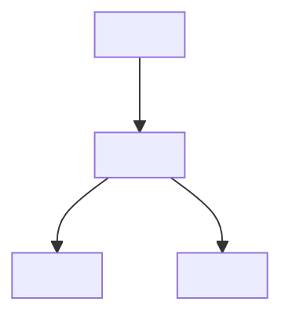
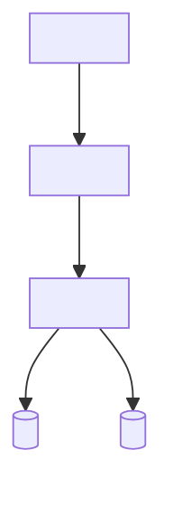

# C4 Model: <System Name>

> **C4 Model** (https://c4model.com)
> Generated by SDLC Workflows — review and adjust.

## Context (Level 1)

## Containers (Level 2)

## Components (Level 3)
### <Container Name>

## Deployment (Level 4)
- **<Container>** runs on <infrastructure>
- **<Container>** scales by <strategy>
- **<Container>** communicates via <protocol>

## Key Relationships
| Source | Destination | Protocol | Data | Frequency |
|---|---|---|---|---|
| <component> | <component> | <HTTP/gRPC> | <payload> | <real-time/batch> |
